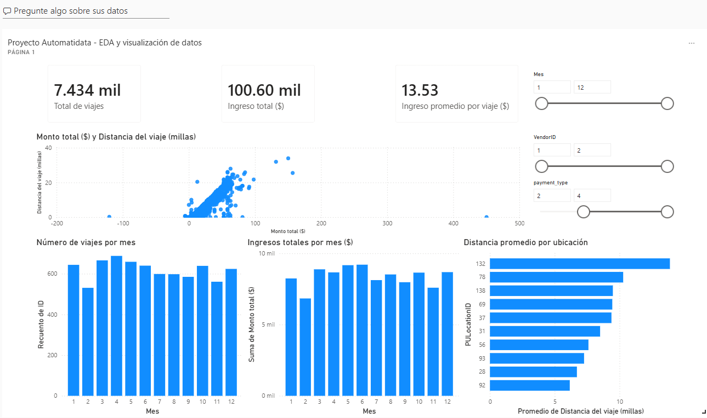
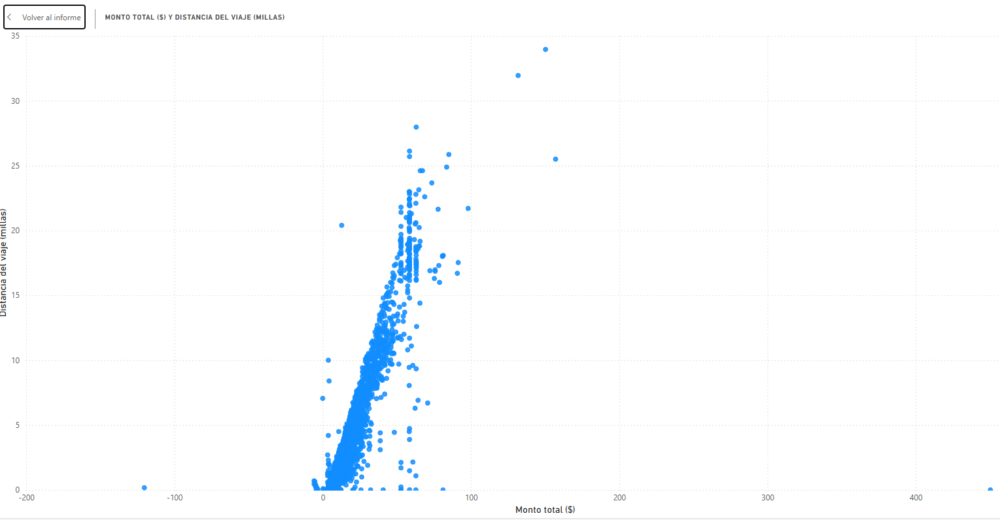

# 🚕 Proyecto Automatidata — TLC (EDA y Visualización)
**Análisis Exploratorio de Datos (EDA) + Dashboards | Go Beyond the Numbers**


---

## 🧠 Sobre el Proyecto

Automatidata colabora con la **Taxi and Limousine Commission (TLC) de Nueva York** para analizar datos históricos de viajes de taxi.  
El objetivo de este proyecto es **traducir datos en insights accionables** mediante:

- Validación de calidad de datos (nulos, rangos, valores atípicos)
- Análisis exploratorio de datos (EDA) con Python
- Visualización y comunicación de hallazgos en **Tableau** y **Power BI**
- Documentación metodológica (PACE) y resumen ejecutivo

📌 **Alcance:** Este repositorio se centra en **EDA + Visualización + Comunicación**.  
❌ **No incluye modelado predictivo**.

---

## 🔑 Insight Clave

> **La mayoría de los viajes son cortos y de bajo costo; las distribuciones de distancia, duración y montos muestran sesgo a la derecha, con presencia de valores atípicos (incluyendo montos negativos y extremos).**

---

## 📊 Principales Resultados

**Datos del proyecto**
- Registros analizados: **22,699**
- Valores faltantes: **0** (sin nulos)

**Métricas del dashboard (visión general)**
- Total de viajes: **7.434 mil**
- Ingreso total: **100.60 mil ($)**
- Ingreso promedio por viaje: **13.53 ($)**

**Hallazgos destacados**
- Relación **positiva** entre `trip_distance` y `total_amount`, con dispersión alta en viajes de mayor distancia.
- Patrones temporales por **mes** (variación en volumen e ingresos).
- Diferencias por **proveedor (VendorID)**, **método de pago (payment_type)** y **ubicación** (PU/DO).

---

## 🗂️ Estructura del Repositorio

```
automatidata-tlc-eda-visualization/
│
├── data/
│   └── README.md
│
├── notebooks/
│   └── automatidata_tlc_eda_portfolio.ipynb
│
├── dashboards/
│   ├── tableau/
│   └── powerbi/
│
├── documents/
│   ├── PACE/
│   │   └── PACE_Automatidata_TLC.pdf
│   └── executive_summary/
│       └── Resumen_Ejecutivo_Automatidata_TLC.pdf
│
├── images/
│   └── README.md
│
├── requirements.txt
└── README.md
```

---

## 📄 Documentos del Proyecto

| Tipo | Archivo |
|------|---------|
| 📘 Notebook (EDA) | [automatidata_tlc_eda_portfolio.ipynb](notebooks/automatidata_tlc_eda_portfolio.ipynb) |
| 📄 PACE (Metodología) | [PACE_Automatidata_TLC.pdf](documents/PACE/PACE_Automatidata_TLC.pdf) |
| 🧾 Resumen Ejecutivo | [Resumen_Ejecutivo_Automatidata_TLC.pdf](documents/executive_summary/Resumen_ejecutivo.pdf) |
| 📊 Evidencia Tableau | [Carpeta de imágenes](dashboards/tableau/) |
| 📈 Evidencia Power BI | [Carpeta de imágenes](dashboards/powerbi/) |

---

## 🔧 Cómo Ejecutar el Proyecto

1. **Clonar el repositorio**
   ```bash
   git clone https://github.com/fcamasca/automatidata-tlc-eda-visualization.git
   ```

2. **Crear entorno virtual (opcional)**
   ```bash
   python -m venv venv
   source venv/bin/activate     # Linux/Mac
   venv\Scripts\activate       # Windows
   ```

3. **Instalar dependencias**
   ```bash
   pip install -r requirements.txt
   ```

4. **Abrir el notebook**
   ```bash
   jupyter notebook notebooks/automatidata_tlc_eda_portfolio.ipynb
   ```

---

## 🧪 Tecnologías y Librerías

- Python  
- Pandas  
- NumPy  
- Matplotlib  
- Jupyter Notebook  
- Tableau  
- Power BI  

---

## 📈 Evidencias Visuales (ejemplos)

### 🔹 Dashboard PowerBI


### 🔹 Diagrama de dipersión - Distancia del viaje vs Monto total


---

## 📬 Autor

**Frankz Camasca**  
Analista de Datos | EDA • Visualización • Storytelling con datos

[](https://github.com/fcamasca)  
[](https://www.linkedin.com/in/frankz-william-camasca-castillo-b63a0094)

---

## 📄 Licencia
Proyecto de uso educativo y demostración profesional.
